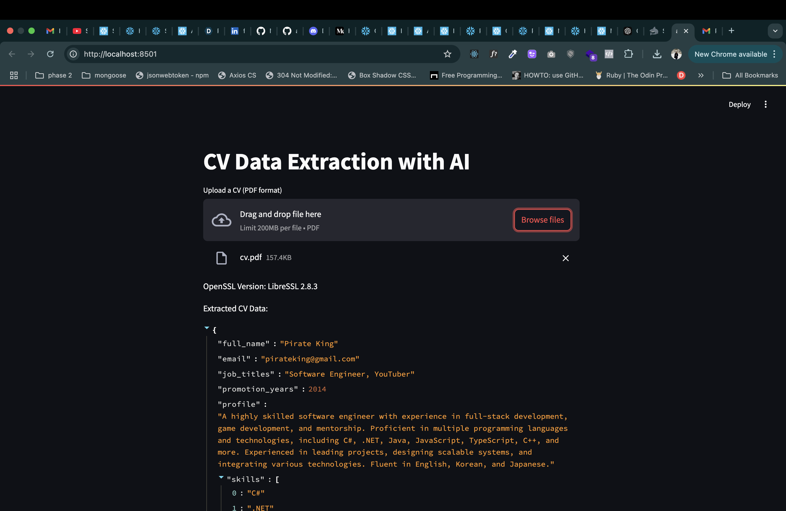

# CV Data Extraction with AI

This project is a Streamlit application that extracts data from CVs in PDF format using AI models. The application uses the Mistral AI model to process and extract structured data from uploaded CVs.

## Requirements

- Python 3.7 or higher
- The following Python packages (listed in `requirements.txt`):
  - streamlit
  - pandas
  - langchain-core
  - langchain-mistralai
  - pypdf
  - pydantic
  - langchain-community

## Setup

1. Clone the repository and navigate to the project directory.
2. Install the required packages using pip:
   ```sh
   pip install -r requirements.txt
   ```
3. Set the `MISTRAL_API_KEY` environment variable with your Mistral AI API key. You can do this by creating a `.env` file in the project directory with the following content:
   ```
   MISTRAL_API_KEY=your_api_key_here
   ```

## Running the Application

To run the Streamlit application, use the following command:

```sh
streamlit run app.py
```

## Input

- The application accepts a CV in PDF format uploaded via the Streamlit file uploader.

## Output

- The application extracts and displays the following structured data from the uploaded CV:
  - Full name
  - Email address
  - Job titles
  - Promotion years
  - Profile
  - Skills
  - Professional experiences
  - Educations
  - Publications
  - Distinctions
  - Certifications

## How It Works

1. The user uploads a CV in PDF format using the Streamlit file uploader.
2. The application saves the uploaded file to a temporary path.
3. The PDF is loaded and split into pages using the `PyPDFLoader` from `langchain_community.document_loaders`.
4. The text content from all pages is combined into a single string.
5. A `CVDataExtraction` model schema is defined using Pydantic to structure the extracted data.
6. The Mistral AI model is initialized using the API key from the environment variable.
7. The structured output model is used to extract data from the combined text.
8. The extracted data is displayed in JSON format on the Streamlit app.

## Example

After running the application, you will see a file uploader to upload a CV in PDF format. Once uploaded, the application will process the PDF and display the extracted data in a structured format.


